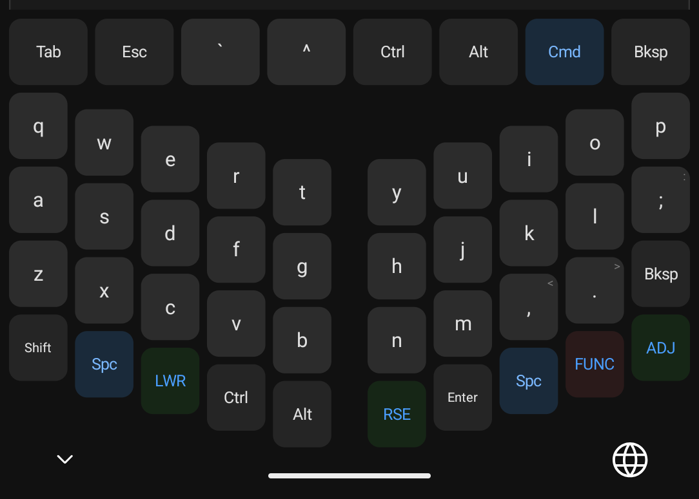

# CodeKeyboard

A split, column-staggered Android keyboard (IME) for coders, with a matching React Native in-app keyboard.

## Layout



Column-staggered split layout (Sofle/Corne inspired) with ZMK-style layers, home row mods, and thumb layer-holds.

## Features

- 5 layers: base, lower, raise, adjust, func
- Hold-tap: home row mods (a/s/d/f/h/j/k/l) and thumb layer-holds (both Space keys)
- Double-tap to LOCK modifiers and layers
- Backspace auto-repeat (400ms initial, 50ms repeat)
- Native IME service with canvas rendering (no WebView)
- React Native in-app keyboard fed layout through a native bridge

## Build

Push to `master` -- GitHub Actions builds `app-release.apk` automatically.

```bash
cd android && ./gradlew assembleRelease
```

## Project structure

```
CodeKeyboard/
  src/                   React Native app (Keyboard, Settings, Themes)
  android/app/src/main/java/com/codekeyboard/   Native IME (Kotlin)
    KeyboardLayout.kt      KeyDef, KeyRect, PositionedKey
    KeyboardState.kt       Modifier/layer state machine + hold-tap state
    NativeKeyboardView.kt  Canvas renderer + touch handler
    SofleKeyData.kt        Layer key definitions (5 layers, V5)
    SofleLayoutComputer.kt Geometry calculator
    TapMachine.kt          Double-tap detector
    CodeKeyboardIME.kt     IME service entry point
    CodeKeyboardModule.kt  RN native bridge
```

## Relevant docs

- [PLAN.md](PLAN.md) -- full project plan
- [GESTURE_ARCHITECTURE.md](GESTURE_ARCHITECTURE.md) -- tap/double-tap/hold-tap pipeline
- [UX_DESIGN.md](UX_DESIGN.md) -- design decisions
